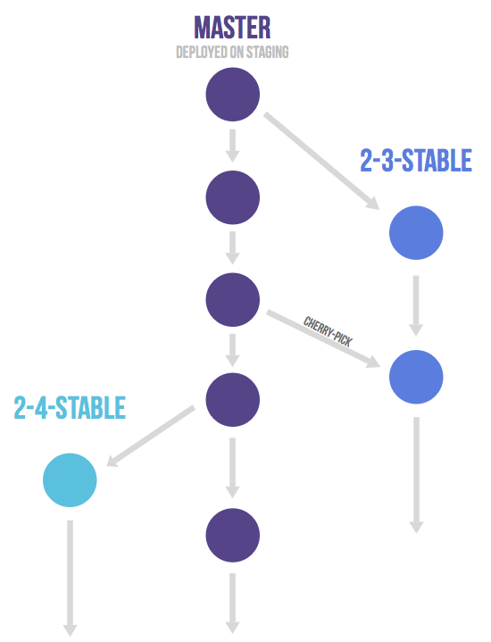

# Git 工作流程规范

## 关于

多人协作时，必须有一套规范的工作流程，让大家有效地合作，使项目井井有条地向前发展。

目前，社区中存在若干种被广泛采用的 Git 工作流程。[Gitlab flow](https://docs.gitlab.com/ee/workflow/gitlab_flow.html) 作为 [Git flow](http://nvie.com/posts/a-successful-git-branching-model/) 与 [Github flow](https://guides.github.com/introduction/flow/) 的综合，既有适应不同开发环境的弹性，又有单一主分支的简洁性。本文档详细描述了该规范。

## 目的

本规范约束了使用 Git 进行协作的方式和流程，以期达到如下目的。

1. 实现[功能驱动式开发模型](https://en.wikipedia.org/wiki/Feature-driven_development)（Feature-Driven Development, FDD）;
2. 实现对项目的持续交付、集成和部署；
3. 规范参与者的开发行为，保证项目的良性发展。

## 上游优先

Gitlab flow 的基本原则是“上游优先”（upstream first），任何改动只能从上游传递到下游。`master` 作为唯一的主分支，是所有其他分支的上游。

## 分支

允许存在下列几种分支。

| 分支   | 生命周期 | 命名规则                                     | 描述                     |
| ---- | ---- | ---------------------------------------- | ---------------------- |
| 主干分支 | 长期   | master                                   | 所有其他分支的上游              |
| 环境分支 | 长期   | 与部署环境的名字保持一致，例如：staging, pre-production, production | 适用于要求持续部署的项目，对应特定的部署环境 |
| 版本分支 | 长期   | 与版本号保持一致，例如：1-0-3-alpha, 1-0-3-beta, 1-0-3-stable | 适用于需要版本发布的项目，对应特定的版本号  |
| 功能分支 | 短期   | 与 issue 的名字保持一致，并且以 issue 的编号开头，例如： 15-require-a-password-to-change-it | 适用于修复 bug 或**添加功能**    |

## 两种场景

Gitlab flow 规定，对于持续部署和版本发布两种情况，使用不同的开发流程。

### 持续部署

对于要求持续部署的项目，在 `master` 分支以外应该建立若干环境分支。例如，“预览环境”对应的分支是 `pre-production` ，“生产环境”对应的分支是 `production`。针对不同的项目要求，建立不同的环境分支。

`master` 分支是预览分支的上游，预览分支是生产分支的上游。任何改动，只能由上游向下游发展。例如，对于生产分支的 bug，必须从 `master` 分支创建一个 bugfix 分支，先把它合并到 `master`，确认没有问题后，将改动 `cherry-pick` 到预览分支，这一步也确认没有问题，才进入生产分支。

### 版本发布

对于需要对外发布版本的项目，对于每一个稳定版本，都要从 `master` 分支新建一个版本分支，比如 `2-3-alpha`、`2-3-beta`、`2-3-stable` 等。

## Pull Request

主干分支受到保护，无法直接更改。

Issue 分支合并进主干分支，必须通过 Pull Request。

## Issues

Issues 用于 bug 追踪与需求管理。Gitlab flow 要求，先新建 issue，再新建对应的功能分支。功能分支总是为了解决一个或多个 issue。

Pull Request 被接受之后，issue 关闭，对应的功能分支被删除。如果以后该 issue 重新打开，新分支可以复用原来的名称。

## 合并 Commit