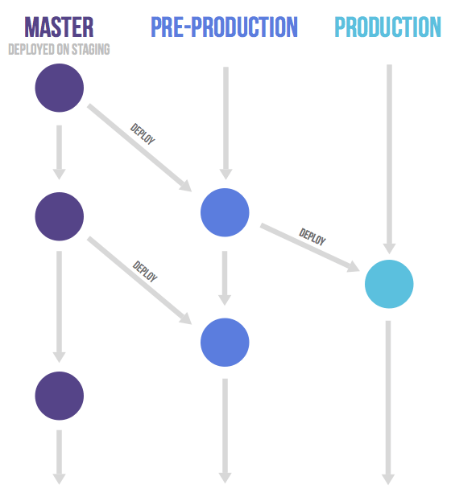

# Git 工作流程规范

## 目录

* [关于](#关于)
* [目的](#目的)
* [上游优先](#上游优先)
* [需求驱动](#需求驱动)
* [分支类型](#分支类型)
* [两种场景](#两种场景)
  * [持续部署](#持续部署)
  * [版本发布](#版本发布)
* [Pull Request](#pull-request)
  * [主分支受到保护](#主分支受到保护)
  * [合并 Pull  Request](#合并-pull-request)
* [参考](#参考)

## 关于

多人协作时，必须有一套规范的工作流程，让大家有效地合作，使项目井井有条地向前发展。

目前，社区中存在若干种被广泛采用的 Git 工作流程。Gitlab flow 作为 Git flow 与 Github flow 的综合，既有适应不同开发环境的弹性，又有单一主分支的简洁性。本文档详细描述了该规范。[1], [2], [3]

## 目的

本规范约束了使用 Git 进行协作的方式和流程，以期达到如下目的。

1. 实现需求驱动式开发模型（Feature-Driven Development, FDD）；[4]
2. 实现对项目的持续交付、集成和部署；[5]
3. 规范参与者的开发行为，保证项目的良性发展。

## 上游优先

Gitlab flow 的基本原则是“上游优先”（upstream first），任何改动只能从上游传递到下游。`master` 作为唯一的主分支，是所有其他分支的上游。[6]

## 需求驱动

Gitlab 要求采用需求驱动式开发模型。需求分为多种，可以是修复 bug、添加功能或提升性能等。需求是开发的起点，针对需求创建新的需求分支。需求开发完成之后，该新分支就被合并到主分支，然后被删除。

Issues 用于管理需求。开发过程中，首先新建 issue，再新建对应的需求分支。需求分支总是为了解决一个或多个 issue。[7]

需求分支的名称，可以与 issue的名字保持一致，并且以 issue 的编号起首，比如 15-require-a-password-to-change-it。

需求开发完成后，提请一个 pull request。[8]

Pull Request 被接受之后，改动合并到主干分支，issue 关闭，对应的分支被删除。如果以后该 issue 重新打开，新分支可以复用原来的名称。

## 分支类型

在 Gitlab flow 中，允许存在下面几种分支。

| 分支   | 生命周期 | 命名规则                                     | 描述                     |
| ---- | ---- | ---------------------------------------- | ---------------------- |
| 主干分支 | 长期   | master                                   | 所有其他分支的上游              |
| 环境分支 | 长期   | 与部署环境的名字保持一致，例如：staging, pre-production, production | 适用于要求持续部署的项目，对应特定的部署环境 |
| 版本分支 | 长期   | 与版本号保持一致，例如：1-0-3-alpha, 1-0-3-beta, 1-0-3-stable | 适用于需要版本发布的项目，对应特定的版本号  |
| 需求分支 | 短期   | 与 issue 的名字保持一致，并且以 issue 的编号开头，例如： 15-require-a-password-to-change-it | 适用于修复 bug 或添加功能        |

## 两种场景

Gitlab flow 规定，对于持续交付和版本发布两种情况，使用不同的开发流程。

* 持续交付场景适用于要求持续运行的 SaaS 应用；[9]
* 版本发布场景适用于要求对外发布版本的客户端应用。

### 持续交付

持续交付要求每一次提交都不会破坏服务的可运行状态，代码在每次修改之后都会被证明是可以工作的（这要求有足够全面的自动化测试集合）。即使它被破坏了，问题也能很快被发现并可以立即被修复。[10]

对于要求持续交付的项目，在主分支以外，应该建立若干环境分支。预览分支是 `pre-production`，生产分支是 `production`。

主分支是预览分支的上游，预览分支是生产分支的上游。任何改动，只能由上游向下游发展。例如，对于生产分支的 bug，必须从主分支创建一个需求分支，bug 修复以后，先把需求分支合并到主分支，确认没有问题后，将改动 `cherry-pick` 到预览分支，这一步也确认没有问题，才最终进入生产分支。

### 版本发布

对于需要对外发布版本的项目，对于每一个稳定版本，都要从主分支新建一个版本分支，比如 `2-3-alpha`、`2-3-beta`、`2-3-stable` 等。

主分支是版本分支的上游。版本分支不能直接修改，任何 bug 修复，必须先合并到主分支，确认没有问题后，才将改动 `cherry-pick` 到版本分支，并同步更新小版本号。

## Pull Request

### 主分支受到保护

主分支受到保护，所有人都不能直接修改主分支，只有代码库的主维护者拥有合并 Pull Request 的权力。

需求分支想要合并进主干分支，必须通过 Pull Request。

### 合并 Pull Request

合并 Pull Request 之前，要确保需求分支与主分支没有分叉。如果两个分支存在分叉，必须通过 `rebase` 命令重建需求分支。另外，必须通过 `squash` 命令将需求分支上的所有提交节点合并为一个提交节点。

然后，合并 Pull Request 到主分支，始终使用 fast forward 方式进行。

最后，关闭对应的 issue，并删除需求分支。

## 参考

1. [Gitlab flow](https://docs.gitlab.com/ee/workflow/gitlab_flow.html)
2. [Git flow](http://nvie.com/posts/a-successful-git-branching-model/)
3. [Github flow](https://guides.github.com/introduction/flow/)
4. [Feature-Driven Development, FDD](https://en.wikipedia.org/wiki/Feature-driven_development)
5. [Continuous Delivery](http://martinfowler.com/bliki/ContinuousDelivery.html)
6. [Upstream First: Turning OpenStack into an NFV platform](https://community.redhat.com/blog/2015/03/upstream-first-turning-openstack-into-an-nfv-platform/)
7. [Github: Mastering Issues](https://guides.github.com/features/issues/)
8. [Github: About Pull Requests](https://help.github.com/articles/about-pull-requests/)
9. [Software as a Service, SaaS](https://en.wikipedia.org/wiki/Software_as_a_service?oldformat=true)
10. 《持续交付 - 发布可靠软件的系统方法》，Jez Humble, David Farley

